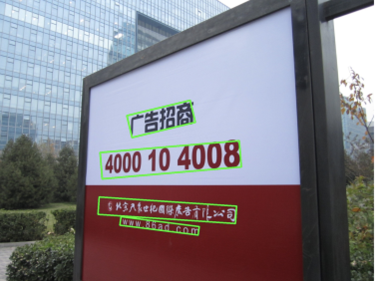

不知不觉已经工作两年了。这两年的主要工作落在“DeepLearning”+”OCR“上，从完全没有接触过OCR，至今算是比较清晰这个领域的近期发展趋势了，那么也是时候写一写文章记录一下。

本文将介绍OCR领域如何细分为多个子问题，如果把若干个子问题串联一起成为一个完成的OCR系统。
先进行整体介绍，能够更好地为后续文章服务。后续文章将进一步介绍其中几个重要的子问题如何利用深度学习建模。

[TOC]

## Motivation

### 

## System

### Input

OCR系统的输入一般是三通道图像，转化为数据格式为 [N,C,H,W]的图像，然后送入OCR系统

图一 自然场景

TODO

图二 业务场景

TODO

图三 奇葩场景

### Output

OCR系统的输出一般为坐标+文字，由于现代机器学习一般应用强监督手段，所以系统的输出往往也是训练数据的标注真值。由于算法模型或者业务需求的不同，文字的表示有以下几种：

* N * (word-level/line-level bounding box + string)

  词级别/行级别矩形框 + 字符串，现阶段已经很少有这种表示，因为矩形无法满足文字的多样性。

* N * (word-level/line-level quadrilateral + string)

  词级别/行级别四边形 + 字符串，**是目前的主流，能够表示多种方向多种形状的文字。**

* N * (character-level quadrilateral + string)

  字符级别四边形 + 字符，**由于标注成本过高，难有真实场景的标注，一般为合成样本。**

实际上对于工业场景实用的场景文字检测识别而言，上述的第二种表示，既能控制标注成本，也能较好地在OCR系统后面进行二次开发，相对而言较为理想。第三种表示虽然精细到字符级别，但是为了后续的文字理解，还需要通过一定的方案重新把字符连接成为具有语义的文本行。

### Sub System

依赖深度学习技术的OCR，目前从大方向上有两种搭建OCR系统的方案：

#### text detection then text recognition

经典的方案如CTPN+CRNN，github上到处都是。

> [1] Tian, Zhi, et al. "Detecting Text in Natural Image with Connectionist Text Proposal Network." *European Conference on Computer Vision* 2016.

> [2] Shi, B., X. Bai, and C. Yao. "An End-to-End Trainable Neural Network for Image-based Sequence Recognition and Its Application to Scene Text Recognition. " *IEEE Transactions on Pattern Analysis & Machine Intelligence* 39.11(2016):2298-2304.

这一类的OCR系统，难点有以下几个：

* 作为两阶级联系统，检测算法的性能上限决定了整体性能，而通用的文字检测至今还是比较困难的问题，除了简单横平竖直的场景，无论是曲形文字，还是重叠文字，还是艺术字，都考验着检测模型。
* 作为两阶级联系统，检测模型与识别模型进行数据传递的时候存在Gap，例如检测的文本框一般比较tight，但是识别的训练数据本身可能相对比较松，这中间存在不小的性能下降。
* 文字的方向实际上还需要一个额外的方法判断。
* 超参数非常多...

#### end-to-end detection and recognition

2018年出来了几篇做end2end检测识别的论文，其中名气最大的应该是FOTS。

> Liu, Xuebo, et al. "FOTS: Fast Oriented Text Spotting with a Unified Network." (2018).

论文Idea非常直接，把文字框对应的特征通过ROIRotate转化成为矩形特征图，然后做识别模型，无论是CTC还是Seq2Seq。算法本身没毛病，但是没能解决一个问题，文字检测和文字识别所需要的数据量不在一个数量级。假如做好文字检测需要的数据量是10W，则识别需要1000W，因为文字识别是一个大类别问题，特别是中文，日语，韩语这种方块字。而且，为了识别模型的性能更佳，往往需要各种各样的样本，例如各种字体，黑体宋体等等。如果直接做End2End模型的话，识别数据可扩展性需要做一些工作来弥补。

